  

  
  &nbsp;
  
  &nbsp;
  
  &nbsp;
  

 

**Dhruv Narayan Bajaj** &nbsp;/&nbsp; Full-Stack Engineer &nbsp;/&nbsp; Systems Programmer

I design and ship complete products end to end, then go a layer deeper and
build the infrastructure those products actually run on. Next.js and
TypeScript on the product side. Rust, C++, OpenGL, and PyTorch on the
systems side. Machine learning where it earns its keep, not where it looks
good on a slide.

 

 

  

  A real terminal running on a static page. Boot sequence, CRT scanlines, a virtual filesystem you can <code>cd</code> and <code>cat</code> through, tab completion, command history, a modal <code>vim</code>, a <code>sudo</code> mini-game that roasts you, playable <code>snake</code>, <code>guess</code>, <code>quiz</code>, and <code>adventure</code> games, and 40+ easter eggs. No build step. One HTML file. Click above to open it.

 

 

  

 

 

## About

I am a full-stack engineer, systems programmer, and occasional AI enthusiast. My work sits in an unusual middle ground: I design and ship complete products end to end, then go a layer deeper and build the infrastructure those products actually run on, rather than treating that infrastructure as someone else's problem. Most engineers pick a lane, product surfaces or platform internals, and stay in it. I have spent the last few years deliberately refusing to choose, because the most interesting failures I have seen in production happened exactly at the seam between the two: a feature that shipped cleanly, then collapsed the moment it met a real database, a real network, or a real adversarial user.

On the product side, that means modern full-stack applications built on Next.js and TypeScript, often solving problems with machine learning and generative AI. I reach for the right tool rather than the fashionable one: XGBoost for structured prediction, PyTorch where a custom model earns its keep, and Google Gemini where a large language model is genuinely the correct primitive rather than the default people reach for when they have run out of ideas. On the systems side, it means writing a distributed version-control system in Rust, building a WebAssembly sandbox to run untrusted plugins safely, and writing real-time OpenGL engines with classical AI behavior underneath them. A\* and Dijkstra do the actual pathfinding instead of a black box I cannot reason about.

The projects below are not toy demos. **agrivision-ai** predicts crop yield and detects pest and disease pressure for Indian farmers, in a setting where a wrong answer costs someone a season. **UPI-ML-Fraud-Detection** runs real-time predictions against Indian digital payment transactions at an 87 percent F1-score, against data that is noisy, imbalanced, and adversarial by construction. **AutoForge** is an AutoML and MLOps platform that takes a raw dataset and produces a profiling and pipeline without the user writing a single estimator call. I care about the difference between a project that compiles and a project that would survive contact with a real user, and I try to build the second kind. If a system cannot survive the user, the model, and the network all misbehaving at once, it is not done yet.

 

 

  

 

## What I believe about building software

These are not platitudes. Each one is a scar from a specific production incident, a specific code review, or a specific 3am debugging session. I list them here because if you are considering hiring me, working with me, or contributing to something I maintain, you should know the rules I play by.

**Ship the thing that survives contact with the user.** A demo that works on your machine under your hand is not a product. A product is what runs when the user is angry, the network is degraded, the data is adversarial, and the third-party API is rate-limiting you. If your system only works in the happy path, you have not finished the happy path yet. The unhappy paths are where the actual engineering happens, and they are where most projects quietly die.

**The right tool is the one that fits the problem, not the one that looks good on a slide.** I have shipped XGBoost where a neural network would have been fashionable and wrong. I have shipped a classical A\* pathfinder where a learned policy would have been impressive and unverifiable. I have reached for Google Gemini where an LLM is genuinely the right primitive, and refused it where a regex would have been faster, cheaper, and more auditable. Tool choice is an engineering decision, not a branding exercise, and the moment you choose a tool because it will look good in a blog post, you have already lost.

**Infrastructure is not someone else's problem.** The most expensive bugs I have ever tracked down lived in the gap between "the application layer" and "the platform layer," where the application team assumed the platform handled something and the platform team assumed the application did. I refuse to draw that boundary sharply. If I am building the product, I want to understand the runtime. If I am building the runtime, I want to understand the product. Specialization is efficient; willful ignorance is a liability.

**A model that compiles is not a model that ships.** An F1-score on a held-out set is a lower bound on production performance, not a guarantee. Real production ML has to survive data drift, adversarial inputs, cold-start users, feature pipeline failures, and the slow decay of every assumption you made when you labeled the training set. The interesting work starts after the notebook ends. I have built fraud detection that runs against genuinely adversarial data, and the lesson is always the same: the model is 20 percent of the system, and the other 80 percent is everything around it that keeps the model honest.

**Every layer of abstraction is a layer you will one day dig through at 2am.** Abstractions are not free. Each one buys you speed now and costs you clarity later, and the bill always comes due during an incident. I am not against abstraction; I am against abstractions that hide things you need to know. The best abstraction is the one that makes the right thing easy and the wrong thing obviously wrong. The worst is the one that makes everything look fine until it isn't.

**Read the source. Write the test. Draw the pointer.** If you do not understand a system well enough to draw its data flow on paper, you do not understand it well enough to debug it. If you cannot write a test that reproduces the bug, you have not found the bug. And if you cannot explain the pointer, the ownership, or the lifecycle, you are going to leak memory, file descriptors, or worse, trust. These are not old-fashioned habits. They are the fastest path to truth that I know of.

 

 

## Featured work

  

 

### agrivision-ai
**AI-powered agricultural intelligence for Indian farmers**

Crop yield prediction, pest and disease detection, soil analysis, and market intelligence. Built to run where bandwidth is unreliable and a wrong answer is expensive, so the inference path is defensive about latency and the model choices are defensive about edge deployment. Gemini handles the unstructured agricultural queries; structured yield and risk prediction stays on classical and gradient-boosted models where the decision boundary is auditable. The interesting design constraint is that a farmer asking "is this crop going to fail" does not have time for a model that hedges, and does not have bandwidth for a model that round-trips a megabyte of context. The architecture is shaped around that constraint.

`Next.js 15 · Google Gemini · TypeScript` &nbsp; &middot; &nbsp; [open repository](https://github.com/Dhuvie/agrivision-ai)

 

### UPI-ML-Fraud-Detection
**Real-time transaction fraud detection at 87% F1**

Tuned to an 87 percent F1-score over Indian UPI transactions, served through notebooks and a Flask API. The interesting part is not the score. It is the class imbalance, the adversarial drift of fraud patterns, and the cost asymmetry between a false positive (a blocked legitimate payment, which loses user trust) and a false negative (a stolen payment, which loses user money). The pipeline is built around that asymmetry rather than around raw accuracy. A model that optimizes for accuracy on this data is a model that blocks nobody and lets everything through, because fraud is rare. The actual objective is a cost function, and the F1-score is just a proxy that happens to correlate with it.

`Python · XGBoost · Scikit-learn · Flask` &nbsp; &middot; &nbsp; [open repository](https://github.com/Dhuvie/UPI-ML-Fraud-Detection)

 

### Pac-man
**Modern C++ Pac-Man with real A*/Dijkstra ghost AI**

A\*/Dijkstra pathfinding driving four distinct ghost personalities, OpenGL rendering, and particle effects. This is the project that exists purely because I wanted to write the algorithm myself instead of importing it, and the difference shows: each ghost has a genuinely different pursuit strategy (Blinky chases directly, Pinky ambushes ahead, Inky flanks with a reflected target, Clyde scatters when close), and the pathing degrades gracefully when the maze state changes mid-frame. The ghost AI is not a state machine pretending to be pathfinding; it is pathfinding with a per-ghost target selection policy layered on top. Writing it in C++17 with OpenGL meant I also had to handle the rendering pipeline, the game loop, and the collision system, which is the point: the whole stack, from adjacency list to pixel.

`C++17 · OpenGL · CMake` &nbsp; &middot; &nbsp; [open repository](https://github.com/Dhuvie/Pac-man)

 

### AutoForge
**AutoML and MLOps platform simulator**

Upload a dataset and AutoForge runs automatic EDA, profiling, and pipeline generation. The goal is to collapse the boilerplate that eats the first three days of any ML project (load, clean, profile, baseline, repeat) into a single workflow that gives you a defensible starting point in minutes. Built with Next.js 16, which means the frontend is doing real work here, not just rendering a form. The interesting design question is where to draw the line between automation and control: too much automation and the user cannot debug the pipeline; too little and the tool saves no time. AutoForge lands on the side of automation with an escape hatch, so every generated step is inspectable and overridable.

`TypeScript · Next.js 16` &nbsp; &middot; &nbsp; [open repository](https://github.com/Dhuvie/AutoForge)

 

### DashCode
**Competitive programming analytics dashboard**

Tracks LeetCode, Codeforces, CodeChef, and HackerRank in one place, with live streaks and global leaderboards. Four inconsistent APIs normalized into one coherent model, with a Postgres layer that handles the awkward fact that "a contest" means something different on every platform. A contest on Codeforces has a rating delta; a contest on LeetCode has a ranking but no delta; a contest on HackerRank might be a sprint or a skill test. DashCode unifies them into a single "competitive event" abstraction without losing the platform-specific signal that actually matters to the user. The hardest part was not the data fetching; it was deciding what to throw away.

`Next.js · TypeScript · PostgreSQL` &nbsp; &middot; &nbsp; [open repository](https://github.com/Dhuvie/DashCode)

 

 

## The rest of the workshop

These are the other public repositories. Some are production-grade, some are experiments, some are tools I built because the existing ones annoyed me. All of them are real.

| Repository | Lang | What it does |
|---|---|---|
| [Medisync](https://github.com/Dhuvie/Medisync) | TypeScript | AI-powered clinical decision support system for triage and diagnostic reasoning |
| [Ecoroute](https://github.com/Dhuvie/Ecoroute) | Python | Route optimization using ensemble ML: XGBoost, LightGBM, CatBoost |
| [Card-Orchestration](https://github.com/Dhuvie/Card-Orchestration) | Python | AI-powered CRM that auto-extracts, enriches, and stores business contact data |
| [Astra_Ledger](https://github.com/Dhuvie/Astra_Ledger) | TypeScript | Production-ready personal finance dashboard with Plaid and Prisma |
| [UniSlot](https://github.com/Dhuvie/UniSlot) | JavaScript | Real-time slot booking and chat for university students with AI moderation |
| [EdgeVision](https://github.com/Dhuvie/EdgeVision) | TypeScript | Edge-deployed computer vision work |
| [Codeolio](https://github.com/Dhuvie/Codeolio) | TypeScript | Developer portfolio and snippet tooling |
| [deadman-crypto-switch](https://github.com/Dhuvie/deadman-crypto-switch) | TypeScript | A dead man's switch for crypto operations |
| [G0DM0D3](https://github.com/Dhuvie/G0DM0D3) | TypeScript | Liberated AI chat |
| [ai-engineering-interview-questions](https://github.com/Dhuvie/ai-engineering-interview-questions) | Markdown | Cheat sheet for AI engineering interviews, questions and answers |
| [free-llm-api-resources](https://github.com/Dhuvie/free-llm-api-resources) | Python | A curated list of free LLM inference resources accessible via API |
| [CommBank-Server](https://github.com/Dhuvie/CommBank-Server) | C# | Banking backend server |
| [CommBank-Web](https://github.com/Dhuvie/CommBank-Web) | TypeScript | Banking web frontend |
| [school-api-assignment](https://github.com/Dhuvie/school-api-assignment) | JavaScript | API assignment |
| [claw-code-real](https://github.com/Dhuvie/claw-code-real) | Python | Better harness tools, not merely an archive of leaked Claude Code |
| [claude-code-leak](https://github.com/Dhuvie/claude-code-leak) | TypeScript | Agentic coding tool that lives in your terminal |
| [claude-code](https://github.com/Dhuvie/claude-code) | JavaScript | Full original source code reconstructed from source maps |
| [portfolio](https://github.com/Dhuvie/portfolio) | CSS | The portfolio site itself |

 

  

 

 

## Research

These are the two areas I read papers about at 1am, not because anyone is paying me to, but because the constraints are genuinely interesting and the existing tools are not good enough yet.

 

**Adaptive quantization in TinyML**
Dynamic, per-layer, runtime-aware quantization to push state-of-the-art accuracy on microcontrollers with under 512 KB of RAM, while cutting energy consumption three to five times over static eight-bit methods. The core idea is that not all layers deserve the same precision at the same moment. A convolution near the input and a classifier near the output fail in very different ways, and a static bit-width throws away budget on layers that could tolerate less. The runtime-aware part matters because the right bit-width for a layer depends on the input distribution, and the input distribution shifts during inference. A quantization scheme that adapts at runtime can claw back accuracy that a static scheme would lose, without paying the energy cost of full precision everywhere.

 

**Memory forensics**
Lightweight tooling and algorithms for post-mortem and live data recovery, anomaly detection, and reverse engineering in constrained embedded environments. The constraint is the point: full desktop forensic stacks do not fit, so the work is about which signals you can recover from a partial, possibly-corrupted image when you cannot assume the kernel is telling you the truth. A compromised kernel will lie about its own process list, its own memory map, and its own network connections. The forensics tool has to cross-validate against raw memory rather than trusting any single source, and it has to do it in a memory budget that would make a desktop tool laugh. This is where systems programming meets security meets embedded, and it is the kind of problem where a creative algorithm beats a bigger budget every time.

 

 

## Stack

  

 

 

  

 

 

  

 

 

  

 

 

## Let's talk

If you read this far, you are exactly the kind of person I want to talk to.

  

&nbsp;

&nbsp;

  

Always glad to talk systems, machine learning, or why I keep rewriting tools that already exist.

