  

  
  &nbsp;
  
  &nbsp;
  
  &nbsp;
  

 

<table>
<tr>
<td width="35%">

</td>
<td width="65%">

Dhruv Narayan Bajaj / Full-Stack Engineer / Systems Programmer

I ship products end to end, then build the infrastructure underneath them. Next.js and TypeScript on the product side. C++, OpenGL, and PyTorch on the systems side. Machine learning where it earns its keep.

</td>

</tr>
</table>

 

 

  

 

 

  

 

 

## About

I am a full-stack engineer, systems programmer, and occasional AI enthusiast. My work sits in an unusual middle ground: I ship complete products end to end, then go a layer deeper and build the infrastructure those products run on, rather than treating it as someone else's problem. Most engineers pick a lane and stay in it. I refuse to, because the most interesting production failures I have seen happened exactly at the seam between product and platform: a feature that shipped cleanly, then collapsed the moment it met a real database, a real network, or a real adversarial user.

On the product side, that means Next.js and TypeScript apps with machine learning and generative AI. I reach for the right tool, not the fashionable one: XGBoost for structured prediction, PyTorch where a custom model earns its keep, Google Gemini where an LLM is genuinely the correct primitive. On the systems side, it means Rust, C++ with OpenGL, and classical AI pathfinding (A\* and Dijkstra) instead of black boxes I cannot reason about.

The projects below are not toy demos. **agrivision-ai** predicts crop yield for Indian farmers where a wrong answer costs someone a season. **UPI-ML-Fraud-Detection** runs real-time fraud detection at 87 percent F1 against adversarial data. I care about the difference between a project that compiles and a project that would survive contact with a real user. If a system cannot survive the user, the model, and the network all misbehaving at once, it is not done yet.

 

 

  

 

## What I believe

Each of these is a scar from a specific production incident, code review, or 3am debugging session.

**Ship what survives contact with the user.** A demo on your machine is not a product. A product is what runs when the user is angry, the network is degraded, and the third-party API is rate-limiting you. The unhappy paths are where the actual engineering happens.

**The right tool fits the problem, not the slide.** I have shipped XGBoost where a neural network would have been fashionable and wrong. I have reached for Gemini where an LLM is genuinely right, and refused it where a regex would have been faster, cheaper, and more auditable. Tool choice is an engineering decision, not a branding exercise.

**Infrastructure is not someone else's problem.** The most expensive bugs live in the gap between "the application layer" and "the platform layer," where each team assumes the other handles it. If I build the product, I want to understand the runtime. If I build the runtime, I want to understand the product.

**A model that compiles is not a model that ships.** An F1-score on a held-out set is a lower bound, not a guarantee. Real production ML has to survive data drift, adversarial inputs, and feature pipeline failures. The model is 20 percent of the system; the other 80 percent is what keeps it honest.

**Every abstraction is a layer you will dig through at 2am.** Abstractions buy speed now and cost clarity later. The best abstraction makes the right thing easy and the wrong thing obviously wrong. The worst makes everything look fine until it isn't.

**Read the source. Write the test. Draw the pointer.** If you cannot draw the data flow on paper, you cannot debug it. If you cannot write a test that reproduces the bug, you have not found it. If you cannot explain the ownership, you will leak memory, file descriptors, or trust.

 

 

## Featured work

  

 

### agrivision-ai
AI-powered agricultural intelligence for Indian farmers. Crop yield prediction, pest and disease detection, soil analysis, market intelligence. Gemini handles unstructured queries; structured prediction stays on gradient-boosted models where the decision boundary is auditable. The architecture is shaped around a constraint: a farmer asking "will this crop fail" has no bandwidth for a model that hedges.

`Next.js 15 · Google Gemini · TypeScript` &nbsp; &middot; &nbsp; [open repository](https://github.com/Dhuvie/agrivision-ai)

 

### UPI-ML-Fraud-Detection
Real-time fraud detection at 87% F1 over Indian UPI transactions. The interesting part is not the score. It is the class imbalance, the adversarial drift of fraud patterns, and the cost asymmetry between a false positive (blocked legitimate payment) and a false negative (stolen money). The pipeline optimizes a cost function, not accuracy.

`Python · XGBoost · Scikit-learn · Flask` &nbsp; &middot; &nbsp; [open repository](https://github.com/Dhuvie/UPI-ML-Fraud-Detection)

 

### Pac-man
C++17 Pac-Man with real A\*/Dijkstra ghost AI, OpenGL rendering, particle effects. Four distinct ghost personalities: Blinky chases directly, Pinky ambushes ahead, Inky flanks with a reflected target, Clyde scatters when close. The ghost AI is pathfinding with a per-ghost target policy, not a state machine pretending to be one.

`C++17 · OpenGL · CMake` &nbsp; &middot; &nbsp; [open repository](https://github.com/Dhuvie/Pac-man)

 

### AutoForge
AutoML and MLOps platform. Upload a dataset, get auto EDA and pipeline generation. The design question is where to draw the line between automation and control. AutoForge lands on automation with an escape hatch: every generated step is inspectable and overridable.

`TypeScript · Next.js 16` &nbsp; &middot; &nbsp; [open repository](https://github.com/Dhuvie/AutoForge)

 

### DashCode
Competitive programming analytics. LeetCode, Codeforces, CodeChef, HackerRank unified into one model. The hardest part was not the data fetching; it was deciding what to throw away. "A contest" means something different on every platform.

`Next.js · TypeScript · PostgreSQL` &nbsp; &middot; &nbsp; [open repository](https://github.com/Dhuvie/DashCode)

 

 

## The rest of the workshop

| Repository | Lang | What it does |
|---|---|---|
| [Medisync](https://github.com/Dhuvie/Medisync) | TypeScript | AI clinical decision support for triage and diagnostics |
| [Ecoroute](https://github.com/Dhuvie/Ecoroute) | Python | Route optimization with XGBoost, LightGBM, CatBoost |
| [Card-Orchestration](https://github.com/Dhuvie/Card-Orchestration) | Python | AI CRM that auto-extracts and enriches contact data |
| [Astra_Ledger](https://github.com/Dhuvie/Astra_Ledger) | TypeScript | Personal finance dashboard with Plaid and Prisma |
| [UniSlot](https://github.com/Dhuvie/UniSlot) | JavaScript | Real-time slot booking and chat with AI moderation |
| [EdgeVision](https://github.com/Dhuvie/EdgeVision) | TypeScript | Edge-deployed computer vision |
| [Codeolio](https://github.com/Dhuvie/Codeolio) | TypeScript | Developer portfolio and snippet tooling |
| [deadman-crypto-switch](https://github.com/Dhuvie/deadman-crypto-switch) | TypeScript | Dead man's switch for crypto operations |
 

  

 

 

## Research

Two areas I read papers about at 1am, because the constraints are interesting and the existing tools are not good enough yet.

**Adaptive quantization in TinyML.** Per-layer, runtime-aware quantization for microcontrollers under 512KB RAM. Not all layers deserve the same precision at the same moment. A convolution near the input and a classifier near the output fail in different ways, and a static bit-width throws away budget. Runtime-aware schemes can claw back accuracy that static schemes lose, without paying full-precision energy costs. Target: 3 to 5x lower energy vs. static 8-bit.

**Memory forensics.** Lightweight tooling for post-mortem and live data recovery in constrained embedded environments. The constraint is the point: full desktop forensic stacks do not fit. A compromised kernel lies about its own process list and memory map. The tool has to cross-validate against raw memory, in a budget that would make a desktop tool laugh. This is where systems programming meets security meets embedded.

 

 

## Stack

  

 

 

  

 

 

## Let's talk

If you read this far, you are exactly who I want to talk to.

  

&nbsp;

&nbsp;

  

Always glad to talk systems, machine learning, or why I keep rewriting tools that already exist.

